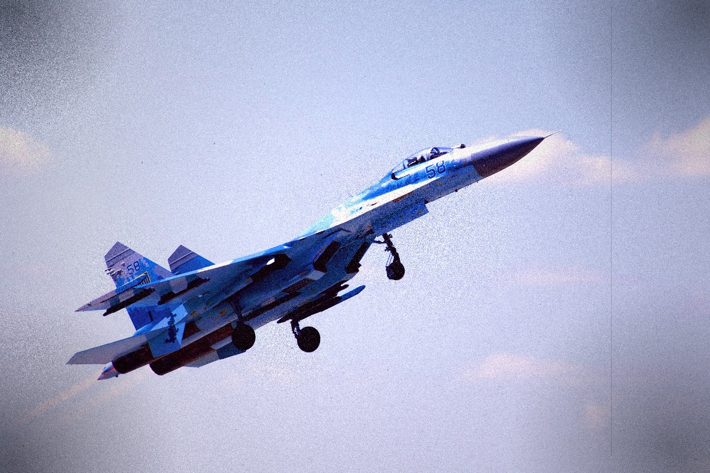

# ПЛЕНКА (Plenka) — 90s Film Machine Simulator 📸

[](https://opensource.org/licenses/MIT)
[](https://alga93.itch.io/soviet-plenka)

**ПЛЕНКА** (Russian for *film/strip*) is a specialized web-based simulator designed to replicate the stochastic behavior of 90s analog photography. Heavily inspired by the **Lomography** movement, this project moves away from static filters in favor of procedural degradation algorithms that emulate chemical and optical imperfections.

---

## 📸 Overview

The core philosophy of **ПЛЕНКА** is "controlled imperfection." The engine simulates light leaks, chemical drifts, and emulsion grain through real-time pixel manipulation, ensuring that no two renders are identical—mimicking the unpredictable nature of expired film stocks and plastic lens cameras (e.g., Lomo LC-A, Holga).


---

## Preview




## 🚀 Key Features

- **Procedural Light Leaks:** Dynamic radial and linear gradients that simulate light entering the camera body through seal failures.
- **Stochastic Grain Engine:** A noise-generation system that recreates the silver halide crystal structure found in high-ISO film emulsions.
- **Chemical Personality Profiles:** Pre-defined algorithmic "personalities" that shift RGBA channels to emulate specific lab conditions:
    - `Heat Damaged`: High contrast with strong magenta/yellow shifts.
    - `Arctic Expired`: Desaturated shadows with a cyan-blue bias.
    - `Expired Warm`: Vintage 90s drugstore lab aesthetic.
- **Asymmetrical Vignetting:** Non-uniform edge darkening to simulate cheap plastic optics.

---

## 🛠️ Technical Architecture

The project is built using a "Vanilla" approach to ensure maximum performance and zero dependency overhead:

- **Core Engine:** HTML5 Canvas API for direct `ImageData` manipulation.
- **Rendering Pipeline:** A sequential processing stack:
  1. **Base Pass:** Contrast, saturation, and exposure bias adjustment.
  2. **Chemical Pass:** Global color drift and mid-tone biasing.
  3. **Optical Pass:** Procedural light leaks and vignette overlays.
  4. **Emulsion Pass:** Multi-layered grain and dust particle generation.
- **Styling:** Brutalist UI designed with CSS3, utilizing `VT323` and `Special Elite` typefaces for a lab-report aesthetic.

---

## 📂 Project Structure

```text
.
├── index.html          # Core application and UI
├── README.md           # Documentation
└── assets/             # Project branding and icon sets

```

---

## 🔧 Installation & Usage

Since the project is a standalone web application, no installation or server-side environment is required.

1. **Clone the repository:**
   ```bash
   git clone [https://github.com/andreluizgreboge/Soviet-Plenka.git](https://github.com/andreluizgreboge/Soviet-Plenka.git)
   ```
2. **Run the application:**
   - Open `index.html` in any modern web browser.
   - Drag and drop an image file into the interface to start the simulation.

---

## 📜 License

Distributed under the MIT License. See LICENSE for more information.

---

**Developed by [André Luiz Greboge](https://github.com/andreluizgreboge)** *Creative Coding & Analog Simulation Experiments*
   
